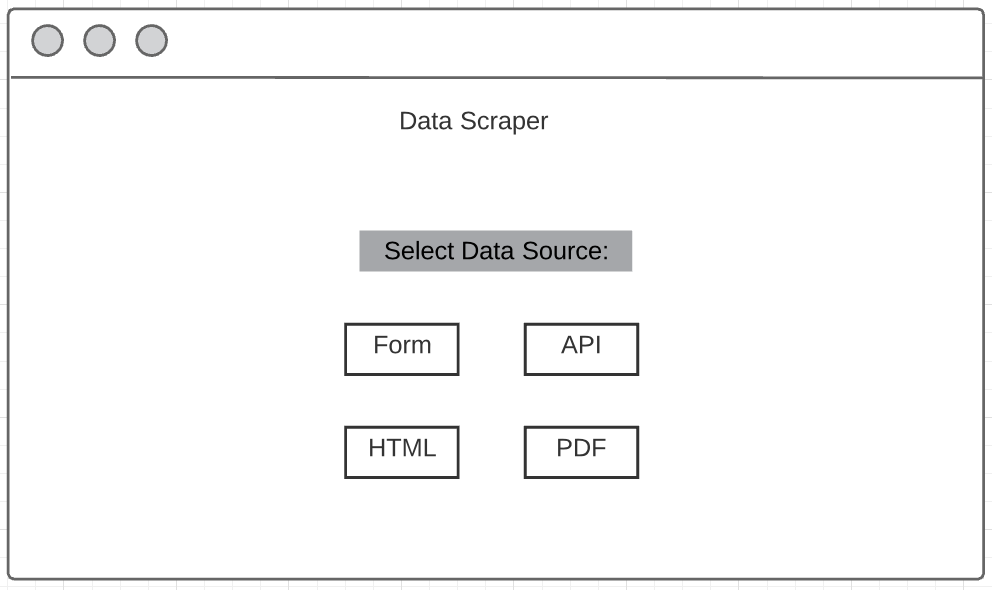
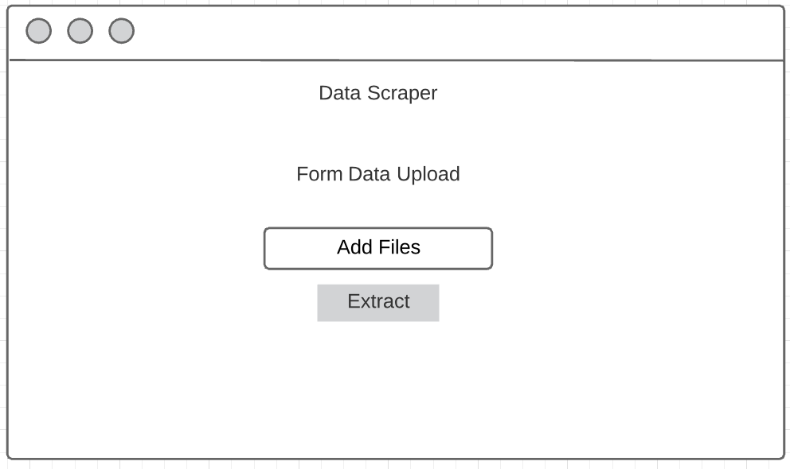
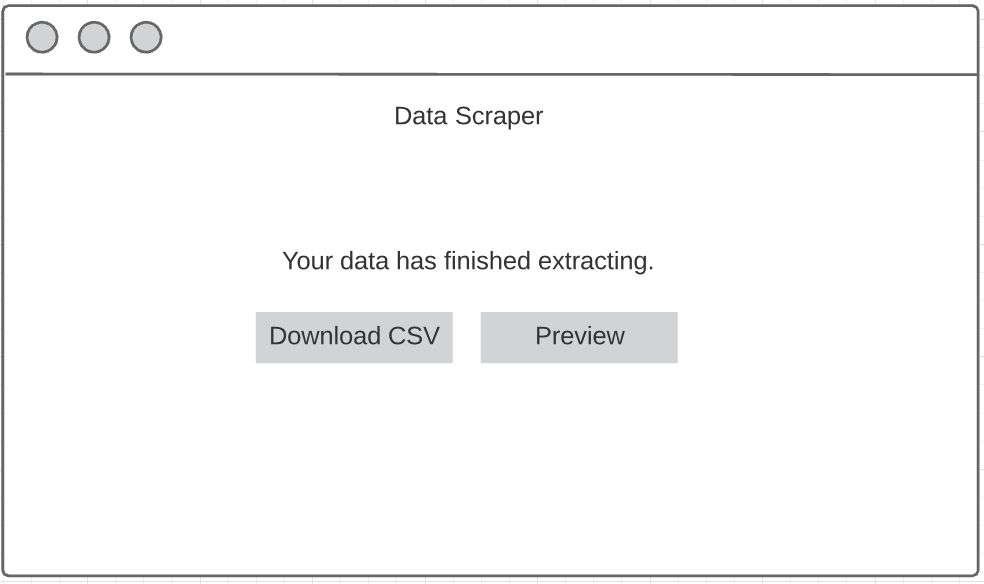

# Design Document

**Author**: HZ-TASK Force

This document will provide description of the application, functionalities and milestones for completion.

**Project goal**: Develop a web application that can convert tables from HTML, PDF, Form, and REST API data sources into CSV files. 

**Stakeholders**:
Tia Pope
Nick Thomas
Elizabeth Shivers
## 1 User Interface
The user interface consists of multiple interfaces. The main interface is the home page where the users will select from four parsing options. 

Each parser will either have an option for the user to upload a file to parse or link an URL.

Once parsing has been completed, it will guide to an interface that will allow users to download as csv.

There will be a download page with a list of job and status.

## 2 Functionality

The web application would need to do the following:

- Form function needs to take in pdf type form file and convert to csv.
- API function needs to take in patient ID and output and convert to csv.
- PDF function needs to take in PDF file and convert tables into csv.
- HTML function needs to take in URL and convert tables into csv.
- Job page with a list of parsing jobs and job status.

## 3 Milestones

Project Kick-off (TS#1) - 9/15/2020

Requirement/Research (TS#2) - 9/29/2020

Design (TS#3) - 10/6/2020

Environment Setup (TS#4) - 10/18/2020

Front End Implementation & Coding (TS#5) - 11/1/2020

Baseline Implementation & Coding (TS#6) - 11/15/2020

Optimization Implementation & Coding (TS#7) - 11/25/2020

Final Implementation & Coding (TS#8) - 12/3/2020
