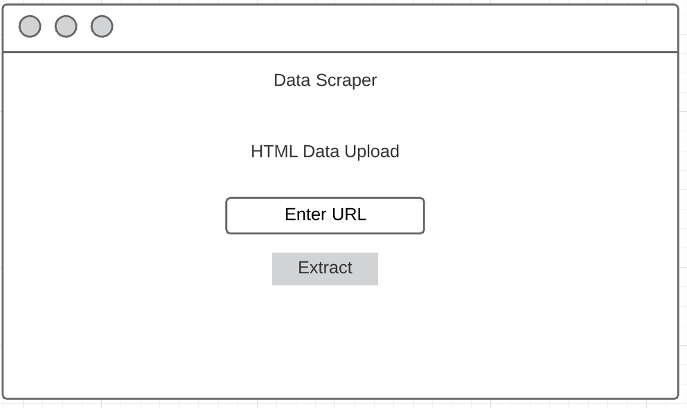
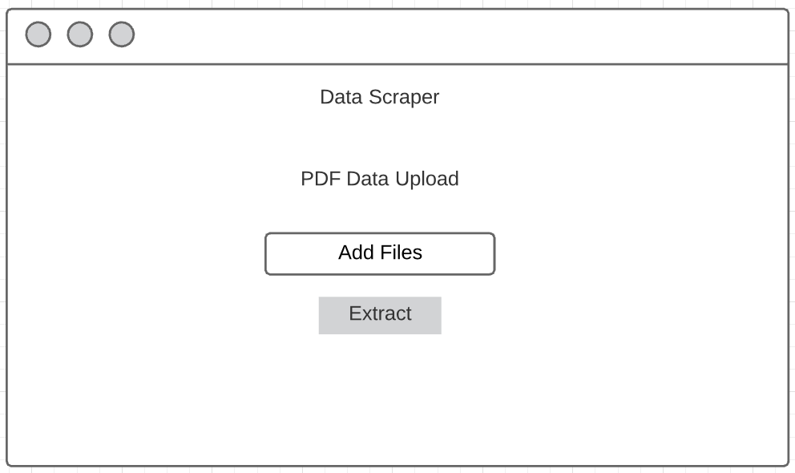

# Design Document

**Author**: HZ-TASK Force
This document will provide description of the application, functionalities and milestones for completion.

**Project description**: Develop a web application that can convert tables from HTML, PDF, Form, and REST API data sources into CSV files. 

**Stakeholders**:
Tia Pope
Nick Thomas
Elizabeth Shivers
## 1 User Interface
The user interface consists of multiple interfaces. The main interface is the home page where the users will select from four parsing options. 

Each parser will either have an option for the user to upload a file to parse or link an URL. 
 {width=250}

## 2 Process Description

*Process description as a set of activities; for each activity, provide the following:*

- *Activity name (verb or verb phrase)*
- *Activity description (concise paragraph)*
- *Entrance criteria (inputs needed for the activity)*
- *Exit criteria (outputs produced by the activity and how you know it has been completed satisfactorily)*

## 3 Team

| Name | Role | Responsiblity |
| ------ | ------ | ------ | 
| SeGe Jung | Project Manager | responsible for understanding the project requirements and aligning the team to work efficienty towards project deliverables. Also responsible for creating project plan, roadmap, and resource allocation. |
| Allen Leigh | Developer | |
| Zahiduzzaman Biswas | Developer | |
| Tommy Wang | QA | |
| Hongyu Cheng | Developer | |
| Kanishkah Anwari | Developer | |
