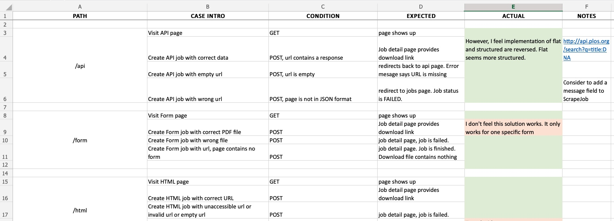

Testing Plan
---
**Team Name**: HZ-TASK Force 

**Team Members**: Allen Leigh, Hongyu Cheng, Kanishkah Anwari, SeGe Jung, Tommy Wang, Zahiduzzaman Biswas 

**Project Name**: Data Scraper 

**GitHub Link**: https://github.gatech.edu/gt-cs6440-hit-fall2020/Data-Scrapper 

## Automated testing

We maintain of a set of automate test suite along the way as we develop the project. The project uses MVC architecture pattern, each components are highly decoupled. This gives us the advantage to test each components individually. We follow some best practics of TDD during our development.

The test suites includes:

* Model unit tests: test on data CRUD, data model behaviors, library functionalities etc.
* Controller unit tests: simulate users by sending requests using http client, and verify the behavior of the system.

## Engineering quality assurance during development

We use the `master` branch of GIT as the source of truth of our code. All the development works happen on feature branch rather than directly on the `master` branch. We enforce a hard requirement when merging a feature branch to master, that the pull request have to satisfy two types of testing:

* 100% pass our automated test suite
* Web server can be started locally

Optionally, for changes that affects the setup of the project, E.g. database configuration or generating absolute URL based on the host name, we also require the change be tested on HDAP using the `deploy` branch.

## Final acceptance test

As the project goes into the final stage, we drafted out a detailed test plan according to our designed use cases, which includes all the workflows that users can perform on our application, with data input variants. The expected behaviors are documented before the testing starts, to ensure neurality. We take into consideration of many edge cases, to improve the robustness. The cases are tested manually from browser on both local and HDAP environments. We passes all the test cases before the final submission of the project.

Here is a link to our [acceptance testing spreadsheet](https://gtvault-my.sharepoint.com/:x:/g/personal/aleigh6_gatech_edu/EZTD0m5PPDJPoyKN5gBIvgMBwnci1R2FwxsJpJnYADulnA?e=mLjZsU).

